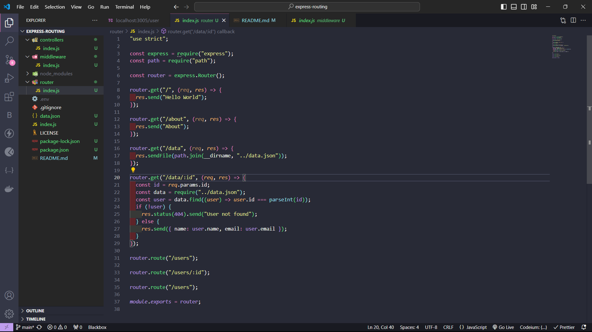
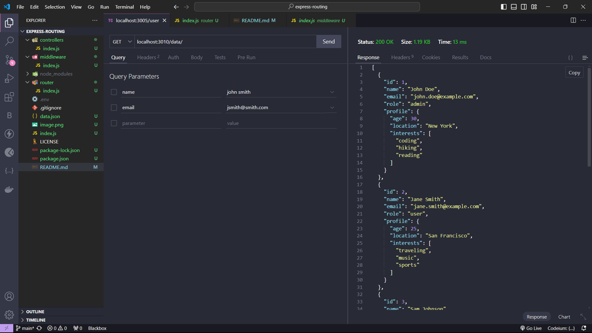

# Express-Routing

This is a [README](https://github.com/CodeX-Bootcamp/express-routing/blob/main/README.md) for the Express-Routing project.

## Description

This project is a simple example of how to use express and routing. Folders and files are made fot the routes, the controllers, and the middleware.

## Express application

The app.js file contains the application logic. It is the entry point of the application. It is where the routing happens.

```bash
npm init -y
npm install express
npm i --save-dev nodemon
```

Above is the bash commands to get my express.js project started.

## Middleware

The middleware file that is imported to my main index.js file shows this message in Thunder Client when the user can't asses the json information.

```js
app.use((req, res, next) => {
  console.log("Time:", Date.now());
  res.status(500).send("Internal Server Error");
  next();
});
```

## Controllers

The function in the controller file as a async function that allows my json file to be accessed.

```js
async function getData(req, res) {
  const response = await fetch("http://localhost:3010/data");
  const data = await response.json();
  res.send(data);
}
```

## Routes

The routes.js file contains the routes. It is where the routes are defined. It is where the controllers are defined. It is where the middleware is defined.

Here is the logic for my routers that allows my to get and show json information.



## Testing

I used Thunder Client to asses all the information and see what works and doesn't. Thunder Client allows me to enter and HTTP adderss what routes so that I can access and view the json information.



## Conclusion

This project takes a deeper dive into express. With routes, controllers, and middleware a person and create and go deep into the Express.js backend projects.
